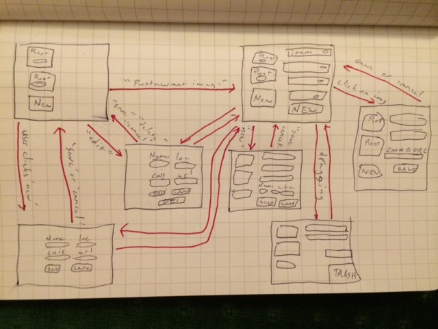

#Internal stats tracker for the_lamplughroup

###1. Feature Spec
  * User can create new restaurant entries by using a popup form.
  * User can edit and delete existing restaurant entries also using a popup form.
  * User can list items at a given restaurant by clicking on the restaurant.
  * Restaurant pulses helpfully to show where the user can click.
  * User looks on in awe as items fade into view.
  * User can create new menu items using a form which appears under the item list.
  * User can update any item image url via a popup form.
  * User can toggle edit mode on an item to update name, price and order count.
  * User can drag an item from one restaurant into another, or into the trash, which also pulses helpfully.

###2. Wire Frame


###3. APIs
  1. skeleton.css: lighter-weight css framework with a smaller grid.
  2. animate.css: a set of super simple to use css animations.
  3. jquery: a js dom manipulation wrapper that makes things easier and more cross browser compatible.
  4. draggabilly: a js library that provides easy dragability to all your divs.
  5. mustache: a js library for front end templating.

###4. Deployment Instructions
  1. clone the repository.
  2. run ```npm install```
  3. run ```bower install```
  4. touch ```restaurant_db```
  5. run ```node_modules/json_server/bin/index.js restaurant_db```

###5. You can see it live [here](http:104.131.60.34:3000/index.html)
